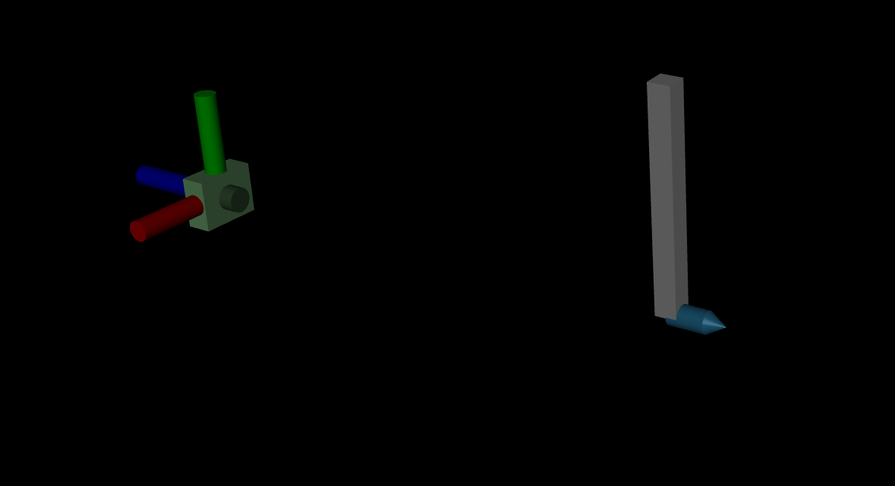

# Embed to Control

Example GIF:


For all of our GIFs, the ground truth trajectory is shown on the left and the latent rollout is shown on the right.

## Instructions
Install requirements and activate virtual environment with:
```
uv sync
source .venv/bin/activate
```

Generate trajectories with:
```
python -m sim.mujoco_data
```

Train with:
```
python train.py --config <config_name>
```

